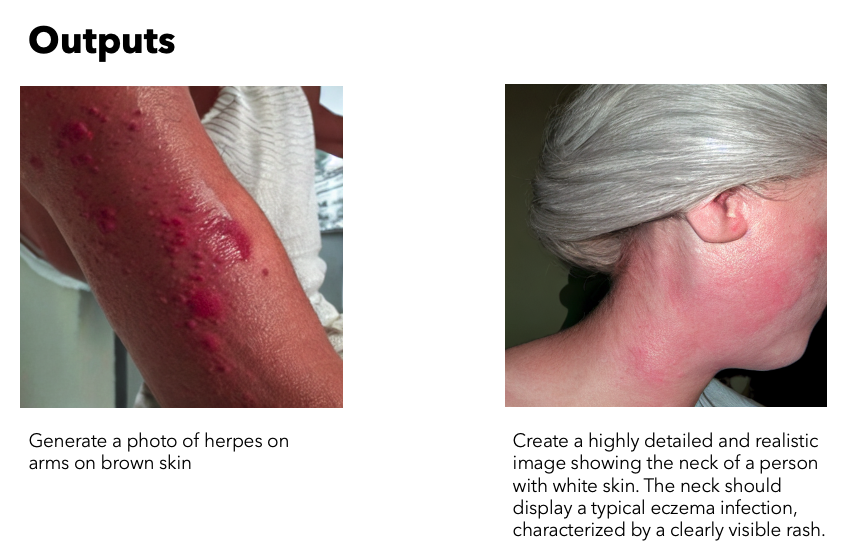

# Medical Image Generator: Skin Rash Visualization

This project aims to generate realistic images of skin rashes based on textual descriptions using a fine-tuned Stable Diffusion model. The generator is designed to produce synthetic medical images of various skin conditions, enhancing medical training, assisting in diagnostics, and providing a valuable educational tool

### Features

* Generates synthetic skin rash images using a fine-tuned Stable Diffusion model
* Supports multiple skin conditions, including Acne, Allergic Contact Dermatitis, Eczema, Folliculitis, Herpes Simplex, Herpes Zoster, Psoriasis, Tinea, and Urticaria

* Customizable image generation parameters including skin color, rash type, and body part 
* Pre-trained model available on [Hugging Face](https://huggingface.co/sayeedahmed/Derma-finetune-Diffusion-Model) for quick start
* Web-based chat application for easy image generation

### Technical Approach
The project fine-tunes various components within the Stable Diffusion pipeline, focusing on the UNet and CLIP component.

### Dataset
The project uses a custom dataset derived from the SCIN (Skin Condition Image Network) dataset, which includes:
* Over 10,000 images of common dermatology conditions 
* Self-reported demographic information, symptoms, and Fitzpatrick skin type
* Dermatologist-labeled conditions and Fitzpatrick skin type

### Future Enhancements
* Expand the dataset to include more diverse skin conditions and severity levels
* Implement data augmentation techniques
* Develop tools for user annotation and refinement of generated images

